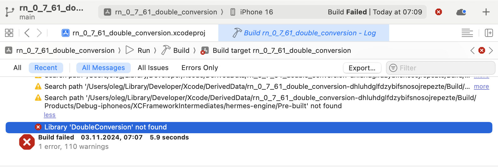

# Xcode Compilation Error "Library 'DoubleConversion' not found" when opening react-native *.xcodeproj

- Problem: Xcode Compilation Error "Library 'DoubleConversion' not found" when opening react-native *.xcodeproj
- Solution: open and run *.xcworkspace in Xcode

## Steps to reproduce

1. Generate react-native project
```
$ npx @react-native-community/cli@15.0.1 init rn_0_7_61_double_conversion --version 0.76.1
```

2. Install pods for iOS
```
$ cd ios

$ bundle install

$ bundle exec pod install
```

3. Open ios/rn_0_7_61_double_conversion.xcodeproj in Xcode, change the signing, start the project, got "Library 'DoubleConversion' not found" Xcode compilation error


4. Open rn_0_7_61_double_conversion.xcworkspace in Xcode and start the project - everything works fine

5. If compilation fails with "Error: EMFILE: too many open files, watch", allow watchman in Settings/Login Items & Extensions/Allow in the Backgroud and run "watchman watch-del-all"